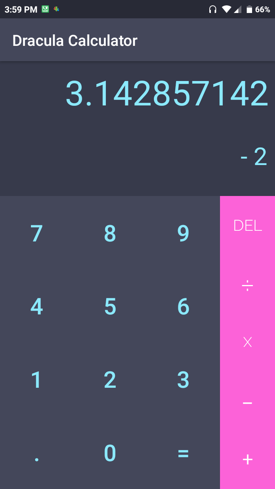
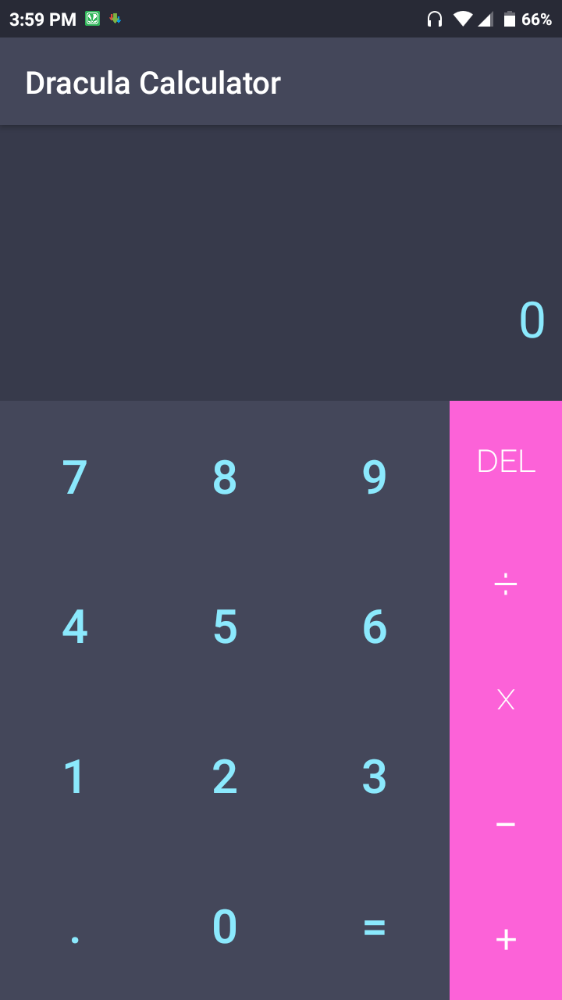

# Dracula-Calculator
A dark themed Calculator for Android. Built in Kotlin using Android Studio 3

## Installation:
1. Download the apk [here](https://github.com/Vivek-abstract/Dracula-Calculator/releases/download/v1.0/Calculator.apk)
2. Enable installation from unknown sources in Settings > Additional Settings > Privacy > Enable Unknown Sources
3. Install the apk

## Screenshots:

